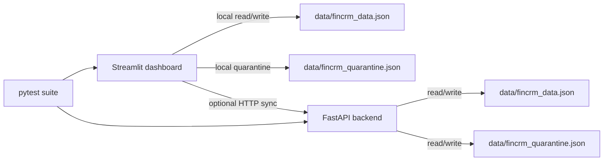

# PRISM Project Context

This file is durable orientation for agents and humans working on PRISM. Keep it concise and update it when architecture, commands, data flow, deployment, or workflow assumptions change.

## Product overview

PRISM is a lightweight FinCRM prototype with:

- a Streamlit dashboard for local CRM/finance workflows
- an optional FastAPI backend for shared JSON persistence
- CSV import/export and validation
- a quarantine flow for invalid imported rows

The application currently focuses on four data sections:

- `transactions`
- `contacts`
- `deals`
- `tasks`

## Repository layout

- `apps/fincrm_dashboard.py`: Streamlit UI, CSV handling, validation, local JSON persistence, optional backend sync, and quarantine UI.
- `api/main.py`: FastAPI backend for data and quarantine persistence.
- `tests/`: pytest coverage for API behavior, dashboard CSV handling, and local data behavior.
- `data/`: runtime JSON storage when the app or API creates local data files. Treat runtime data as environment-specific.
- `Makefile`: standard local commands.
- `.github/workflows/ci.yml`: GitHub Actions workflow that runs pytest on pushes and pull requests.
- `docs/ai/`: AI memory system for project context, decisions, handoffs, runbooks, and templates.

## Common commands

```bash
make install
make test
make run-api
make run-ui
```

Equivalent direct commands:

```bash
python3 -m pip install -r requirements.txt
python3 -m pytest -q
uvicorn api.main:app --reload
streamlit run apps/fincrm_dashboard.py
```

## Runtime architecture



## Data and validation notes

- Local data path: `data/fincrm_data.json`.
- Local quarantine path: `data/fincrm_quarantine.json`.
- The dashboard validates imported rows before accepting them.
- Invalid rows are preserved in quarantine with reasons rather than silently dropped.
- The API normalizes missing or malformed data into the expected top-level sections.
- Writes use atomic replacement patterns to reduce partial-write risk.

## API notes

FastAPI exposes:

- `GET /health`
- `GET /data`
- `PUT /data`
- `GET /quarantine`
- `POST /quarantine/items`
- `DELETE /quarantine/{item_id}`
- `POST /quarantine/{item_id}/restore`

Permissions are controlled with environment variables:

- `PRISM_READ_TOKEN`: allows read endpoints.
- `PRISM_ADMIN_TOKEN`: allows write, delete, and restore endpoints.

If neither token is configured, the API allows admin access for local prototyping.

## CI/CD status

The current GitHub Actions workflow:

- runs on all pushes and pull requests
- uses Python 3.12
- installs `requirements.txt`
- runs `python -m pytest -q`

There is no production deployment workflow documented in this repo yet. If deployment is added, document the environments, required secrets, promotion flow, and rollback procedure in `docs/ai/runbooks/`.

## Agent workflow expectations

Before substantial work:

1. Read `AGENTS.md`.
2. Read this file.
3. Check recent handoffs in `docs/ai/handoffs/` if continuing work.

After substantial work:

1. Update this file only if stable project context changed.
2. Add a decision record in `docs/ai/decisions/` for meaningful architecture, deployment, product, or workflow choices.
3. Add a handoff in `docs/ai/handoffs/` with the commands/tests run and known follow-ups.

## Open documentation gaps

- Deployment environments and hosting provider are not documented.
- Rollback and recovery procedures are not documented.
- Secrets management for deployed environments is not documented.
