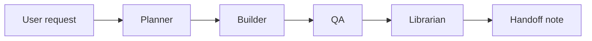

# Agent Workflows

Use these workflows to keep AI-assisted work simple and repeatable. Pick the smallest workflow that fits the task.

## Workflow map

Not every task needs every step. Tiny documentation fixes may only need Builder plus a brief verification note.

## New feature workflow

Use when adding user-visible behavior or a new capability.

1. **Planner**
   - Read `AGENTS.md`, `docs/ai/project-context.md`, and `docs/ai/current-state.md`.
   - Check relevant skill files in `docs/ai/skills/` for security, data, deployment, preservation, or instruction-sync concerns.
   - Identify affected files and likely tests.
   - Keep the implementation scope narrow.
2. **Builder**
   - Implement the feature using existing project patterns.
   - Add or update focused tests when behavior changes.
3. **QA**
   - Run `make test`.
   - Check edge cases, data persistence, and API/UI interaction if relevant.
4. **Librarian**
   - Update `docs/ai/project-context.md` only if stable architecture or commands changed.
   - Add a decision record for meaningful technical choices.
   - Add or update a handoff in `docs/ai/handoffs/`.

## Bug fix workflow

Use when behavior is broken, inconsistent, or risky.

1. Reproduce or explain the bug with the smallest evidence available.
2. Identify the root cause in code, data, configuration, or environment.
3. Fix the narrowest responsible code path.
4. Add a regression test when practical.
5. Run `make test`.
6. Record durable debugging findings in a handoff or investigation note if the bug is non-obvious.

Use `docs/ai/templates/investigation-template.md` for deeper bugs.
Use `docs/ai/skills/security-and-secrets.md` for auth, token, permission, or secret-related bugs.
Use `docs/ai/skills/data-stewardship.md` for persistence, CSV, schema, or quarantine bugs.

## Documentation cleanup workflow

Use when improving memory, runbooks, README content, or release notes.

1. Read existing docs before adding new files.
2. Merge duplicated ideas instead of creating parallel sources of truth.
3. Keep stable facts in `project-context.md`.
4. Keep current priorities and short-lived gaps in `current-state.md`.
5. Use `docs/ai/skills/instruction-sync.md` when aligning ChatGPT, Codex, Cursor, or repo instructions.
6. Use `handoffs/` for session-specific work notes.
7. Run tests only when code or executable examples changed; otherwise review docs for links, formatting, and accuracy.

## Release preparation workflow

Use when preparing to merge, deploy, or summarize a branch.

1. Review commits and changed files.
2. Run `make test`.
3. Use `docs/ai/skills/github-preservation.md` to confirm commits, branch state, and durable documentation.
4. Check whether memory docs, runbooks, or release notes need updates.
5. Summarize:
   - changes shipped
   - verification performed
   - known risks
   - rollback or recovery notes
6. Use `docs/ai/templates/release-notes-template.md` if a release note is needed.

## Environment or CI workflow

Use when changing dependencies, GitHub Actions, deployment, Terraform, or runtime configuration.

1. Read `.github/workflows/ci.yml`, `Makefile`, `requirements.txt`, and relevant runbooks.
2. Prefer small, observable changes.
3. Use `docs/ai/skills/deployment-readiness.md` before adding deploy or environment automation.
4. Use `docs/ai/skills/security-and-secrets.md` before documenting secrets or permissions.
5. Document new commands, required secrets, and expected environment variables.
6. Add or update a runbook for setup, deploy, rollback, or incident response.
7. Run `make test` and any CI-equivalent checks available locally.

## Completion checklist

Before finishing substantial work:

- Relevant tests or checks were run and recorded.
- Durable context is updated in the smallest appropriate memory file.
- A handoff note exists for multi-step or non-obvious work.
- Known gaps are explicit instead of hidden in chat history.
